# 8051LAB — MCS-51 寄存器参考 & 代码模板

图表由 `gen_8051_charts.py` 和 `gen_8051_overview.py` 生成（需要 `matplotlib`）。

---

## 寄存器图表

### SFR 全览

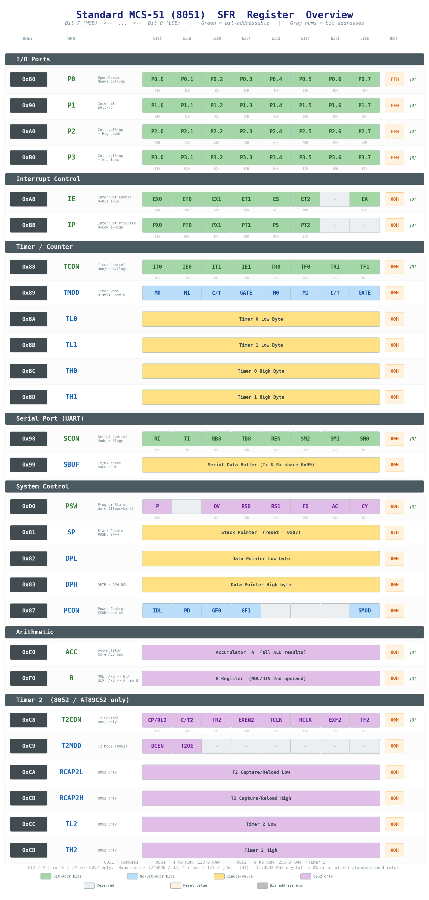

标准 8051 全部 SFR 一览，每行一个寄存器，8 个 bit 逐位展开。绿色格子 = 可位寻址，蓝色 = 不可位寻址，紫色 = 8052 专属。格子下方灰色数字为位地址。最右列为复位值。

### 内存空间

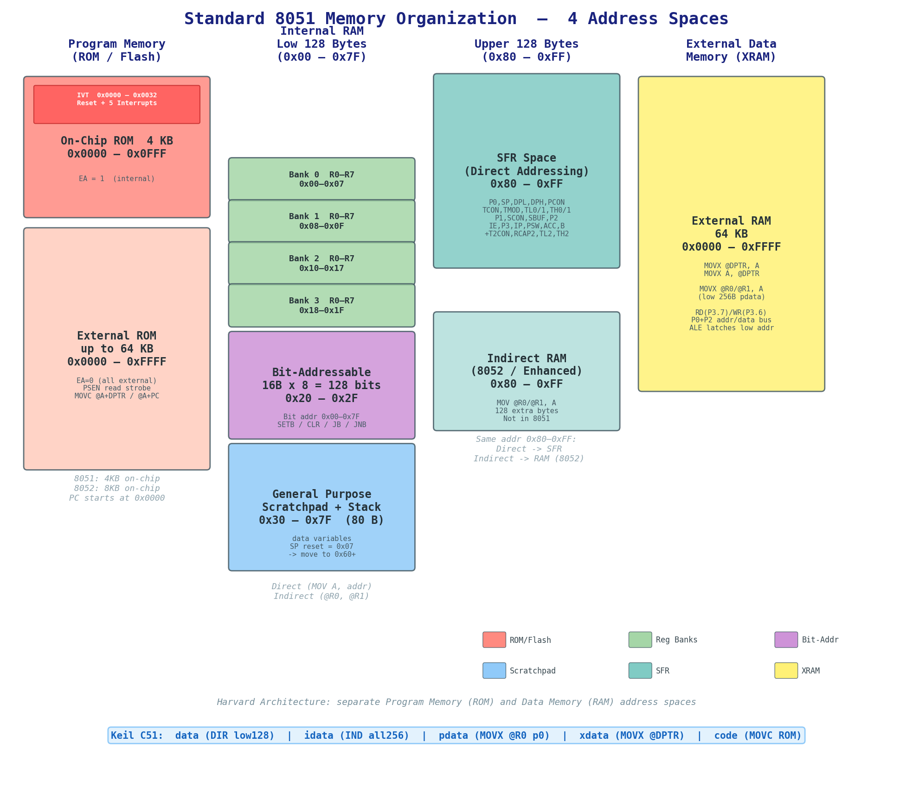

哈佛架构的四个独立地址空间：程序存储器 (ROM) 左侧带中断向量表红色高亮，内部 RAM 低 128 字节含寄存器组和位寻址区，高 128 字节的 SFR 区与间接寻址 RAM (8052)，右侧为外部数据存储器 (XRAM)。

### 内部 RAM 低 128 字节

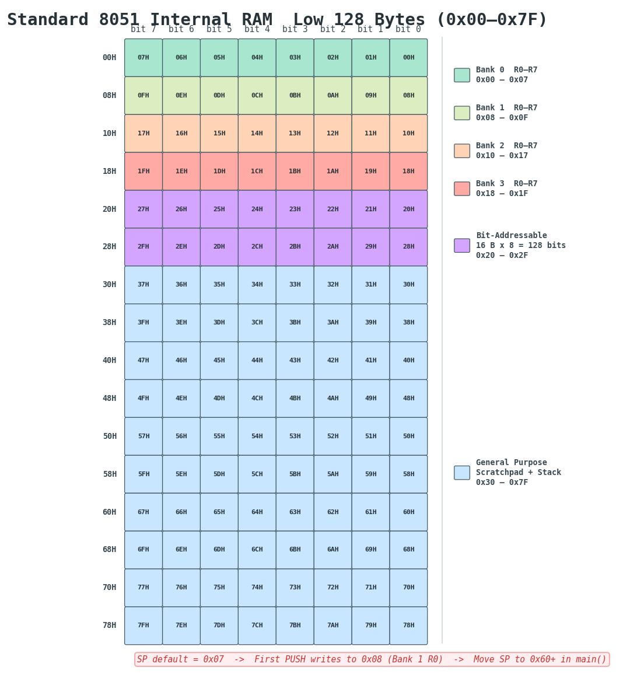

0x00 到 0x7F 逐格色块。寄存器组 Bank 0-3、位寻址区 (0x20-0x2F)、通用数据区 (0x30-0x7F)。底部红色提醒：SP 复位值为 0x07，第一个 PUSH 会写入 0x08（覆盖 Bank 1 的 R0），须在 `main()` 中 `SP = 0x60`。

### ROM 中断向量表

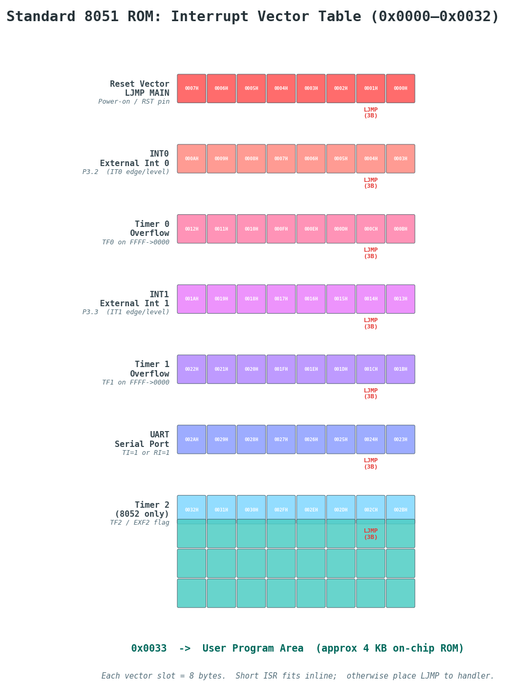

程序存储器最低 0x33 字节。每个中断占 8 字节槽位，通常前 3 字节放 `LJMP` 指令跳转到实际 ISR。下方青色区域为 0x0033 开始的用户程序区。

### 位寻址区

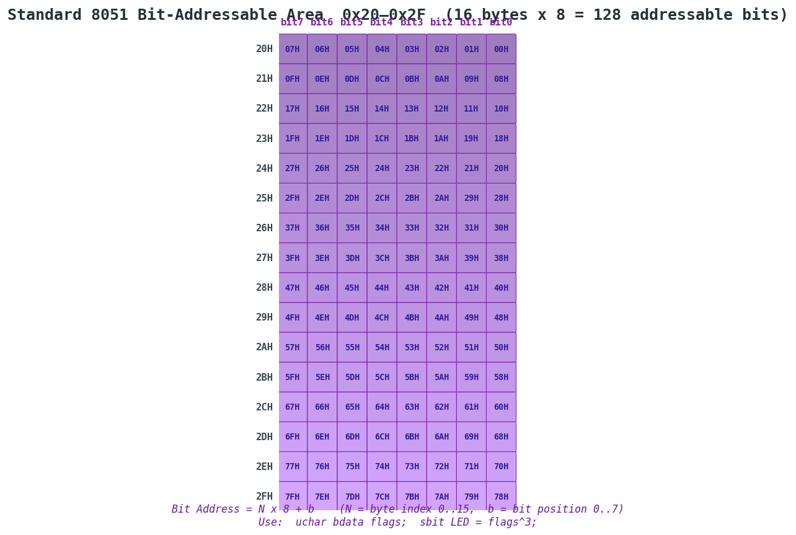

16 字节 x 8 位 = 128 个独立可寻址位 (0x00-0x7F)。位地址 = N x 8 + b。C 语言中用 `uchar bdata flags; sbit LED = flags^3;` 由编译器自动分配。

### SFR 地址映射

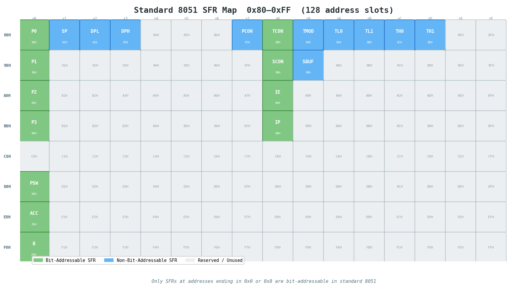

0x80-0xFF 共 128 个地址槽。只有地址末位为 0 或 8 的 SFR 才可位寻址。灰色为保留/未使用。

### IE 中断使能寄存器

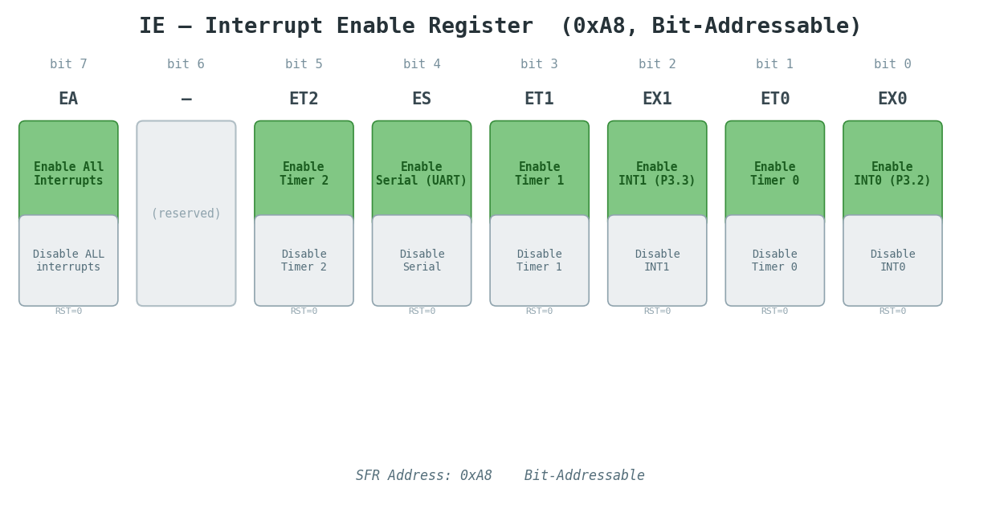

EA 是总开关。每位控制对应中断源的使能 (1=开, 0=关)。ET2 仅 8052 有效。

```c
IE = 0x80;  // 仅开总中断
IE = 0x82;  // EA + Timer 0
IE = 0x90;  // EA + Timer 1 + 串口
IE = 0x81;  // EA + INT0
```

### IP 中断优先级寄存器

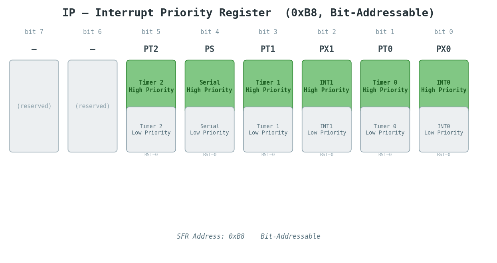

仅两级优先级：0 (低) 和 1 (高)。高优先级 ISR 可打断低优先级。同级中断同时触发时按自然优先级排队。

### 中断自然优先级

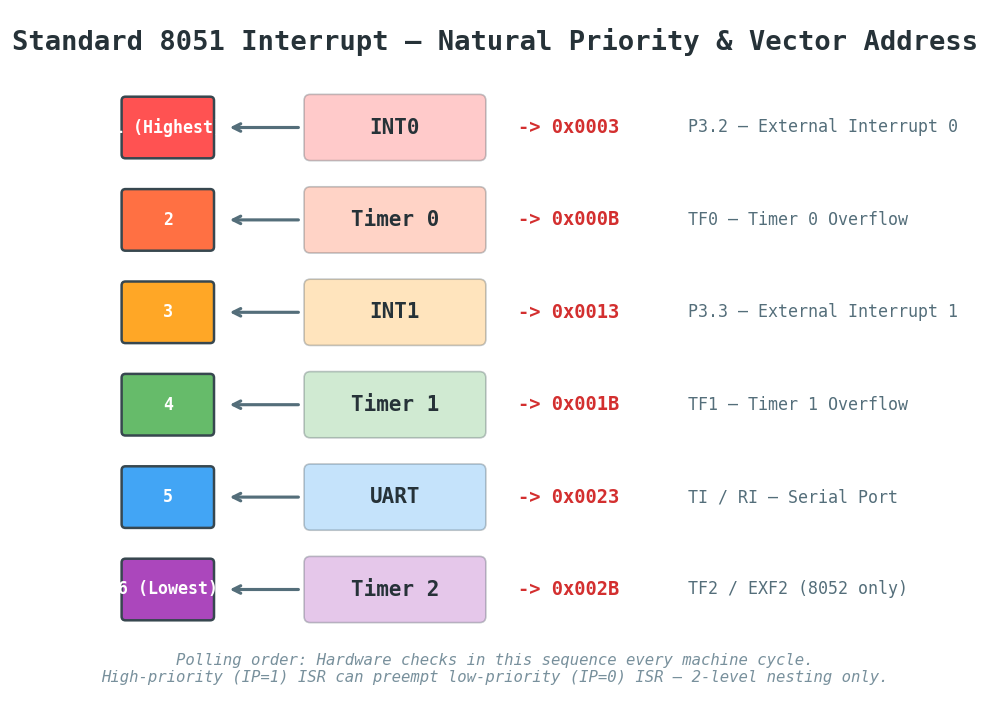

硬件每机器周期按此固定顺序轮询。INT0 始终最先检查。各向量地址间隔 8 字节。

### TCON 定时器控制寄存器

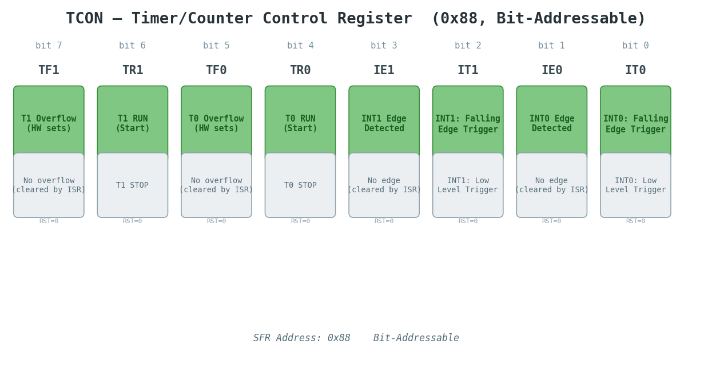

高 4 位控制 Timer 1，低 4 位控制 Timer 0，同时包含外部中断触发方式选择。

```c
TCON = 0x50;  // TR1=1, TR0=1  同时启动两个定时器
TCON = 0x40;  // 仅启动 T1 (UART 波特率)
TCON = 0x05;  // IT0=IT1=1  双外部中断下降沿触发
```

### TMOD 定时器模式寄存器

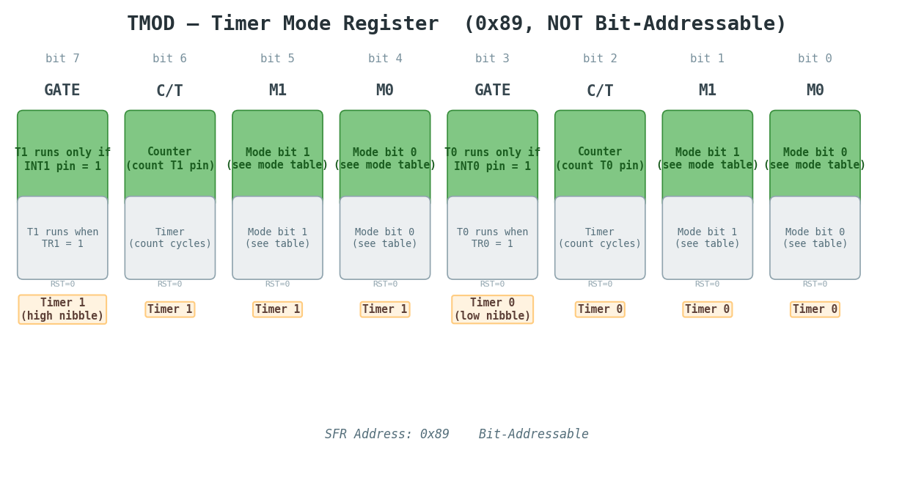

不可位寻址，必须整字节写入。高半字节配置 Timer 1，低半字节配置 Timer 0。每半字节：GATE | C/T | M1 | M0。

### 定时器四种工作模式

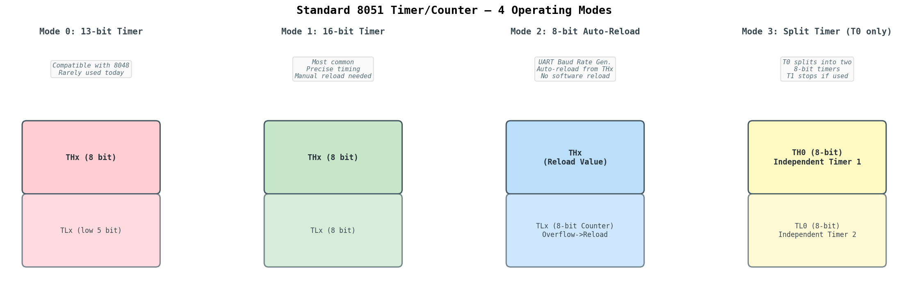

| 模式 | M1:M0 | 位数 | 自动重装 | 典型用途 |
|:---|:---:|:---|:---|:---|
| 0 | 00 | 13 位 | 否 | 兼容 8048，极少使用 |
| 1 | 01 | 16 位 | 否 | 精确计时，ISR 中手动重装 |
| 2 | 10 | 8 位 | 是 (TH->TL) | UART 波特率发生器 |
| 3 | 11 | 双 8 位 (仅 T0) | 否 | 需要三个定时器时 |

```c
TMOD = 0x01;  // T0 模式1, T1 模式0
TMOD = 0x11;  // 双 16 位
TMOD = 0x20;  // T1 模式2 (UART 波特率)
```

**特别地，在T0设置为MODE=3的时候有以下资源分配情况**：


| TL0（8位） | TH0（8位） | T1（16/13/8位） |
|------------|------------|-----------------|
| 定时器/计数器 | 只能定时器 | Mode 0/1/2 运行 |
| TR0 控制启停 | TR1 控制启停 | 不受 TR1 控制 |
| TF0 溢出标志 | TF1 溢出标志 | 无溢出标志可用 |
| ET0 中断使能 | ET1 中断使能 | 无中断能力 |
| GATE0 门控 | 无门控（固定内部） | GATE1 仍有效 |
| C/T0 选择 | 固定定时器模式 | C/T1 仍有效 |


### SCON 串行口控制寄存器

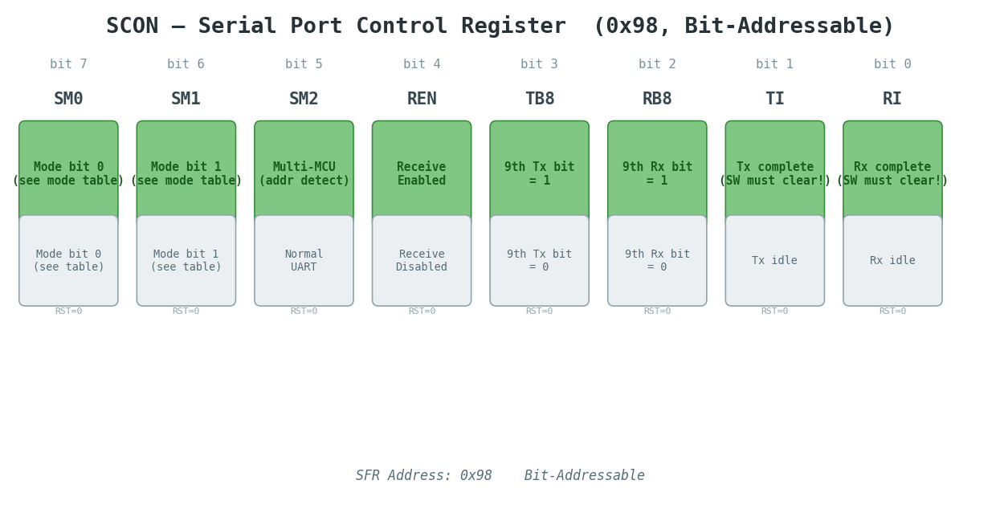

TI 和 RI 必须软件清零——硬件只置位不清零。

```c
SCON = 0x50;  // 模式1 (8位UART), REN=1  标准初始化
```


### PCON 电源控制寄存器

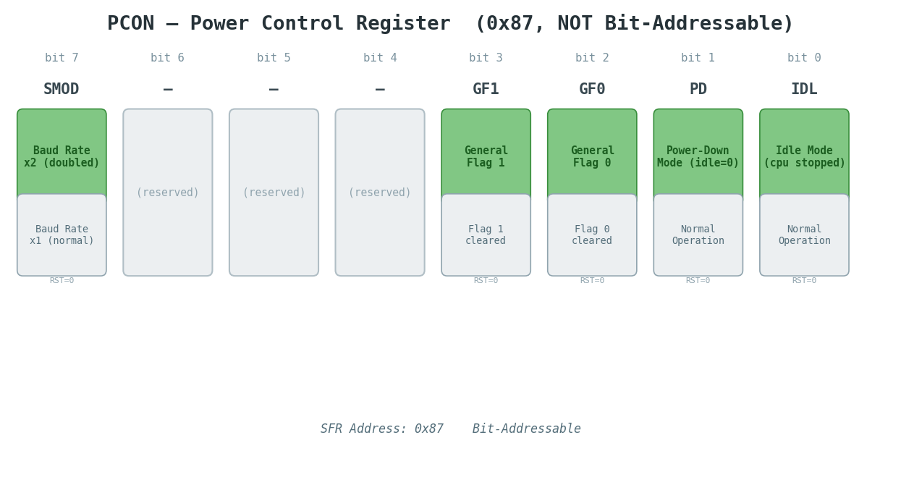

地址 0x87，**不可位寻址**，必须整字节写入。控制串口波特率加倍、两个通用标志位、以及两种低功耗模式。

| Bit | 名称 | 功能 |
|:---:|:---|:---|
| 7 | **SMOD** | 串口波特率倍速：1=加倍，0=正常（见下方波特率公式） |
| 6–4 | — | 保留，未使用 |
| 3 | **GF1** | 通用标志位 1，可作软件标志 |
| 2 | **GF0** | 通用标志位 0，可作软件标志 |
| 1 | **PD** | 掉电模式：1=进入（振荡器停振，仅复位可唤醒） |
| 0 | **IDL** | 空闲模式：1=进入（CPU 停，定时器/串口/中断继续运行；任意中断或复位唤醒） |

> PD 和 IDL 同时置 1 时 PD 优先生效。进入低功耗模式前建议先置位 EA 确保中断可唤醒。

```c
PCON = 0x80;  // SMOD=1  波特率加倍（UART 高速）
PCON = 0x00;  // SMOD=0  波特率正常，正常运行
PCON = 0x01;  // IDL=1   进入空闲模式（等待中断唤醒）
PCON = 0x02;  // PD=1    进入掉电模式（仅复位唤醒）
PCON = 0x08;  // GF1=1   置位通用标志 1
```

SMOD 直接关联下方波特率公式中的 $2^{SMOD}$  因子  
SMOD=0 时分母系数为 384，SMOD=1 时系数为 192，波特率翻倍。

### Keil C51 存储器类型

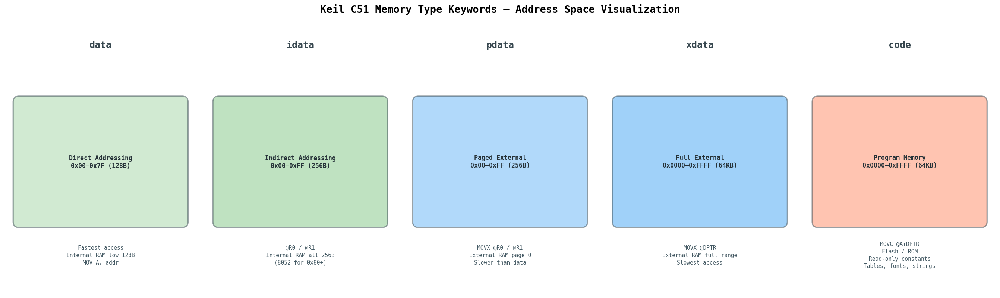

---

## 代码模板

所有模板使用标准 8051 SFR 名称。修改 `fosc` 匹配实际晶振频率。

UART的具体教程推荐阅读[8051 Microcontroller UART (Serial Communication) | Everything You Need to Know](https://junctionbyte.com/8051-microcontroller-uart/)

值得注意的是，只要UART配置好了，keil自动重载了`printf`,`scanf`,`getchar`函数，因此不需要手动重载。

| 函数 | 方向 | 底层调用 |
| :---: | :---: | :---: |
| `printf` | 串口->发 | `putchar()` |
| `scanf` | 串口->收 | `_getkey()` |
| `getchar` | 串口->收 | `_getkey()` |

波特率计算公式，这里以T1M2（自动重装载）为例

$$
\text{Baud} = \frac{2^{SMOD}}{32} \cdot \frac{\text{FOSC}}{12 \cdot (256-TH1)}
$$

SMOD=0：

$$
\text{Baud} = \frac{\text{FOSC}}{12 \cdot 32 \cdot (256-TH1)} = \frac{\text{FOSC}}{384 \cdot (256-TH1)}
$$

SMOD=1，波特率加倍：

$$
\text{Baud} =  2 \frac{\text{FOSC}}{12 \cdot 32 \cdot (256-TH1)}  = \frac{\text{FOSC}}{192 \cdot (256-TH1)}
$$
